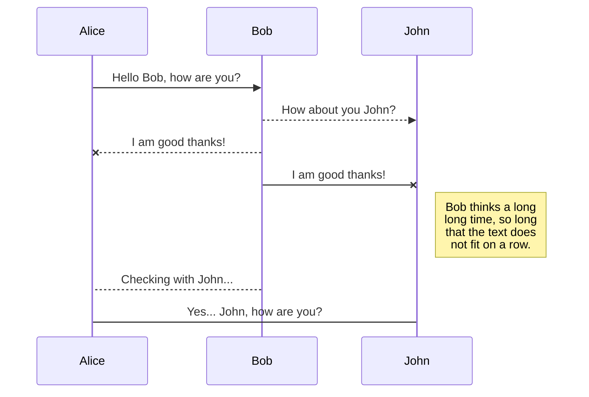
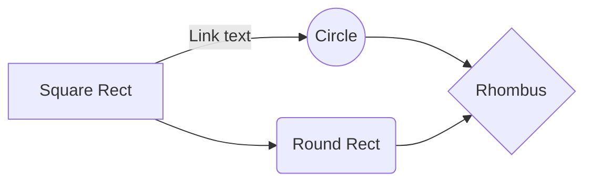

# PGPinDS
Purdue Post Graduate Program in Machine Learning, AI 
([Program Syllabus](https://www.simplilearn.com/ice9/pdfs/agenda/masters-program/Purdue%20Data%20Science%20Master%20Program_v10.pdf))
## **Machine Learning, Data Science, AI & Data Analytics **.

>"Congratulations, you have completed your first lesson and hands-on lab in Python. However, there is one more thing you need to do. The Data Science community encourages sharing work. The best way to share and showcase your work is to share it on GitHub. By sharing your notebook on GitHub you are not only building your reputation with fellow data scientists, but you can also show it off when applying for a job. Even though this was your first piece of work, it is never too early to start building good habits. So, please read and follow this article to learn how to share your work." 
>-- Post Graduate Program in Data Science
  

Accelerate your career with this acclaimed Post Graduate Program in Data Science, in partnership with Purdue University — in collaboration with IBM, and featuring the perfect mix of theory, case studies and extensive hands-on practicum.

  

In Collaboration with: 

  

## Program **Overview**

  

This Post Graduate Program in Data Science gives you broad exposure to key concepts and tools from Python, R to Machine Learning and more. Hands-on labs and project work bring these concepts to life with our trainers and teaching assistants to guide you along the way.

  

### **KEY FEATURES**

  

- Purdue Post Graduate Program Certification

- Purdue Alumni Association Membership

- Masterclasses from Purdue

- Industry-recognized IBM certificates

- 300+ hours of Blended Learning

- 25+ hands-on Projects on Integrated Labs

- Capstone Project in 3 Domains

  
  

## Post Graduate Program **Advantage**

  

This Post Graduate Program in Data Science in partnership with Purdue University is a comprehensive Data Science program – leveraging Purdue’s academic excellence in Data Science and Simplilearn’s partnership with IBM.

  

### PARTNERING WITH PURDUE UNIVERSITY

  

This Post Graduate Program in Data Science is in partnership with [Purdue University](https://online.purdue.edu/), one of the world's leading research and teaching institutions, offering higher education at the highest proven value. Purdue is committed to your success, changing the student experience with a focus on collaboration and the creative use of technology.

  

****Upon completion of this program you will:****

  

- Receive a joint Purdue-Simplilearn certification

- Become entitled to membership in the Purdue University Alumni Association

  

Purdue Certification

  

### PROGRAM IN COLLABORATION WITH IBM

  

IBM is one of the leading innovators in Data Science and infuses this program with industry relevant, hands-on training

  

- Industry recognized IBM certificates

- Access to IBM Watson for hands-on training and practice

- $1200 worth of IBM Cloud credits for hands-on platform exposure

  

## Program **Details**

  

Learn Data Science via a comprehensive curriculum covering statistics, key programming languages, Machine Learning algorithms, and more -- with a capstone project culminating your learning experience.

  

### **LEARNING PATH**

  

- Welcome Class for Purdue Data Science Program

Get started with the Post Graduate Program in Data Science in partnership with Purdue University and explore everything about the program. Kickstart your Data Science journey with the preparatory courses on Statistics and Programming.

- PG DS - R Programming for Data Science

- PG DS - Data Science with R

- PG DS - Python for Data Science

- PG DS - Data Science with Python

- PG DS - Machine Learning

- PG DS - Natural Language Processing

- PG DS - Tableau Training

- PG DS - Data Science Capstone

##### Electives:

- PG DS - IBM Watson for Chatbots

- PG DS - Machine Learning with R

- Academic Master Class – Purdue University

- Industry Master Class – Data Science

  

### **SKILLS COVERED**

  

- Exploratory Data Analysis

- Descriptive Statistics

- Inferential Statistics

- Model building and fine tuning

- Supervised and unsupervised learning

- Natural Language Processing

- Ensemble Learning

  

### **TOOLS** COVERED

  

  

### INDUSTRY PROJECT

  

- Project 1

#### Fare Prediction for Uber

Uber wants to improve the accuracy of its fare prediction model. Help Uber by choosing the best data and AI technologies and building its next-generation model.

- Project 2

#### Test Bench Time Reduction for Mercedes-Benz

Mercedes-Benz wants to reduce the time it spends on the test bench. Faster testing will reduce a cars time to market. Build and optimize the ML algorithm to achieve this objective.

- Project 3

#### Product Rating Prediction for Amazon

Amazon recommends products to customers based on their activity and the buying habits of other customers. Help Amazon to improve the recommendation engine to optimize its revenue per customer.

- Project 4

#### Demand Forecasting for Walmart

Predict accurate sales for Walmart stores considering the impact of promotional markdown events. Check if macroeconomic factors like CPI, unemployment rate, etc. have an impact on sales.

- Project 5

#### Improving Customer Experience for Comcast

Comcast wants to improve customer experience by identifying and acting on problem areas that lower customer satisfaction, they are looking for recommendations that can be implemented.

  

Disclaimer - The projects have been built leveraging real publicly available data-sets of the mentioned organizations.

  
  
  
  

## KaTeX

  

You can render LaTeX mathematical expressions using [KaTeX](https://khan.github.io/KaTeX/):

  

The *Gamma function* satisfying $\Gamma(n) = (n-1)!\quad\forall n\in\mathbb N$ is via the Euler integral

  

$$

\Gamma(z) = \int_0^\infty t^{z-1}e^{-t}dt\,.

$$

  

> You can find more information about **LaTeX** mathematical expressions [here](http://meta.math.stackexchange.com/questions/5020/mathjax-basic-tutorial-and-quick-reference).

  
  

## UML diagrams

  

You can render UML diagrams using [Mermaid](https://mermaidjs.github.io/). For example, this will produce a sequence diagram:

  

  

And this will produce a flow chart:

  

